# Gimnasio API — Código base (Semana 5)

API REST en NestJS para el gimnasio: `Clases`, `Horarios`, `Miembros` e `Inscripciones`, cada
módulo con dominio, DTOs e infraestructura separados (patrón repositorio + inyección por token).
Los datos viven en memoria — ningún repositorio se conecta todavía a una base de datos real.

Este proyecto es el punto de partida de la Práctica 8 (Prisma) y la Práctica 9 (Blindar la API).

## Preguntas Práctica 10.

### Parte 1

**1. ¿Por qué el filtro atrapa la clase base y no cada error por separado?**
Porque los cuatro errores extienden ErrorDeDominio, así que un solo @Catch los atrapa a todos y no hace falta un filtro por error.

**2. ¿Por qué este middleware no podría decidir si un usuario tiene permiso para una ruta?**
Porque corre antes de que Nest sepa a qué método va la petición, entonces no puede leer @Publico() ni @Roles(). 

**3. ¿Por qué la petición que responde 409 no aparece en ese registro?**
Porque el tap solo corre cuando el controller responde correctamente. Si lanza un error se va directo al filtro.

**4. ¿Por qué este cambio rompe a cualquier cliente que ya estuviera usando la API?**
Porque antes GET /clases regresaba un arreglo y ahora regresa { data, meta }, entonces res[0] pasa a ser res.data[0].

**5. Si el servidor respondió en los dos casos, ¿quién bloquea y a quién protege?**
Bloquea el navegador, no el servidor. El servidor respondió 200 en los dos casos, pero el navegador no deja leer la respuesta si el origen no está permitido. 

### Parte 2

**6. ¿Por qué el campo se llama passwordHash y no password?**
Porque con ese nombre es imposible guardar la contraseña en claro por descuido.

**7. ¿Por qué los dos errores del inicio de sesión dicen exactamente lo mismo?**
Para que nadie pueda saber qué correos existen probando uno por uno.

**8. Si el contenido se puede leer, ¿qué es lo que protege la firma?**
Que el contenido no se pueda cambiar sin que se note. Si cambian el payload la firma ya no coincide y el servidor lo rechaza con 401.

**9. ¿Por qué es más seguro proteger todo y abrir a mano que al revés?**
Porque si olvido poner @Publico() en una ruta se nota porque da 401, pero si olvido proteger una ruta queda abierta y nadie lo ve.

**10. ¿Cuál es la diferencia entre un 401 y un 403?**
El 401 es que no sé quién eres (sin token o token inválido). El 403 es que sí sé quién eres pero no tienes permiso.

**11. ¿Cuántas líneas del AuthService tuvieron que cambiar para pasar de memoria a MySQL? ¿Por qué?**
Ninguna, solo cambié el useClass en auth.module.ts para que usara UsuarioPrismaRepository. El AuthService solo conoce la interfaz UsuarioRepository.

**12. ¿Por qué es importante tomar al usuario de los claims del token y no de la URL o del cuerpo?**
Porque el cliente controla la URL y el cuerpo, y el usuario podría mandar miembroId: 3 para inscribir a el otro cliente. El miembroId del token no se puede falsificar porque está firmado con JWT_SECRET.

### Tarea: roles

Solo el entrenador y el admin pueden cancelar inscripciones, con @Roles() y un RolesGuard que se registra después del JwtAuthGuard.

## Evidencias Práctica 10

### Parte 1

**409 con la nueva forma**

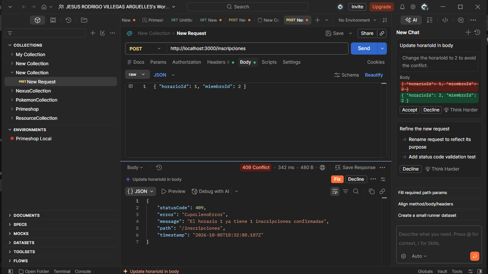

**Respuesta con X-Request-Id**

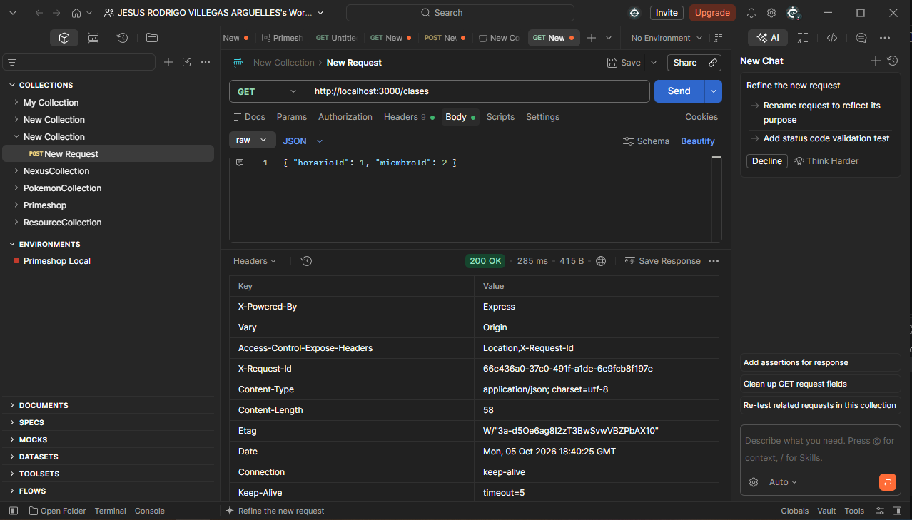

**Consola con los tiempos**

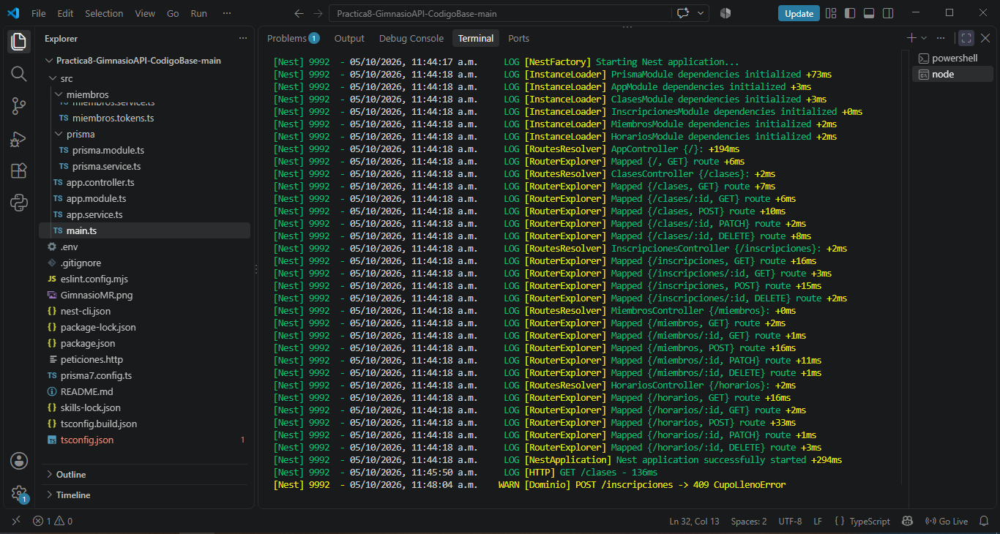

**Respuesta con el sobre**

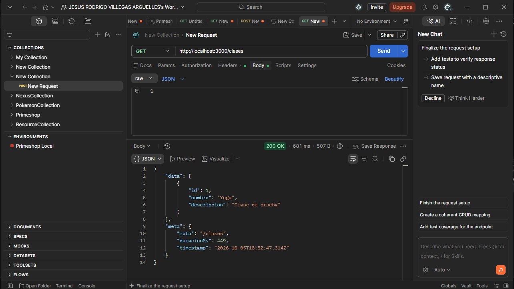

**CORS con origen permitido (5173)**

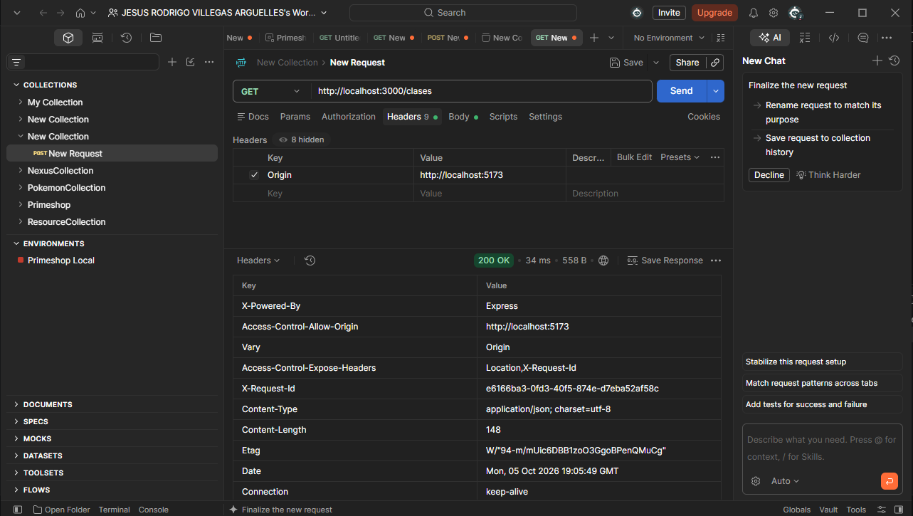

**CORS con origen no permitido (4000)**

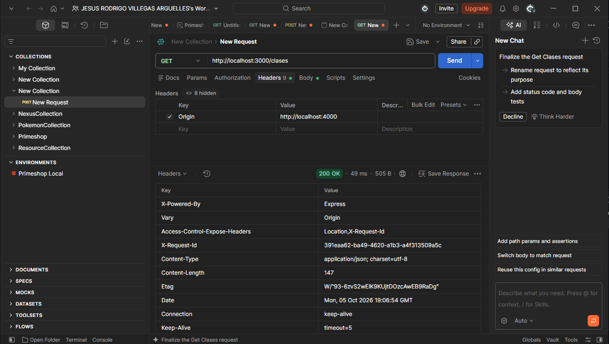

### Parte 2

**401 sin token**

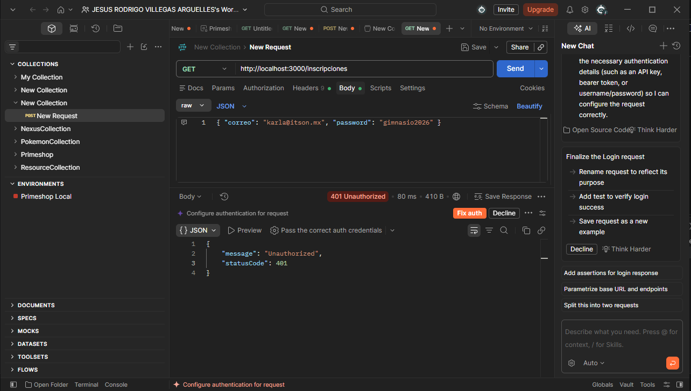

**Inicio de sesión**

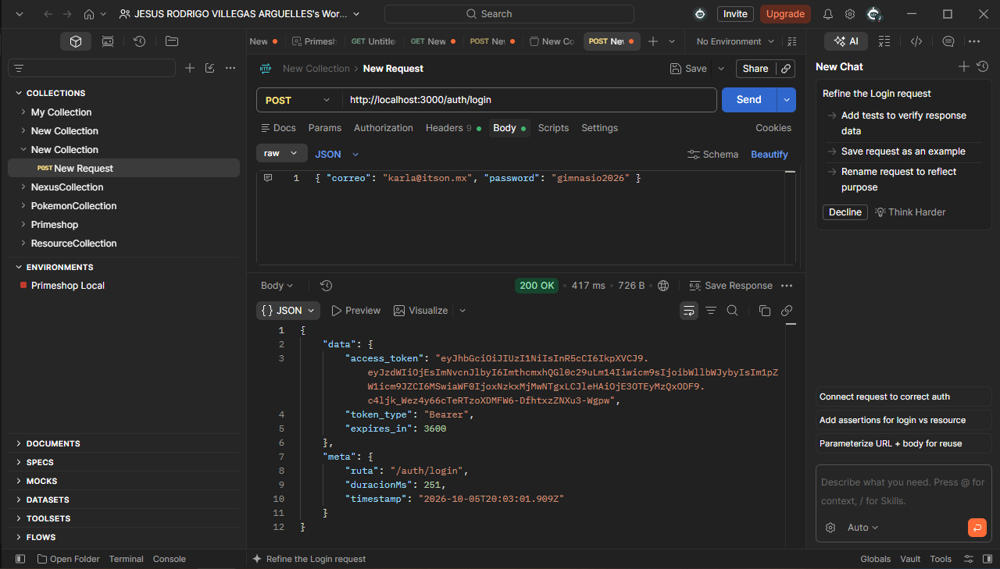

**Datos del token en jwt.io**

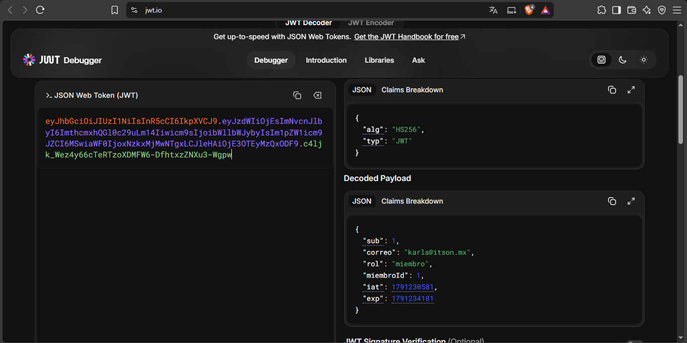

**403 al inscribir a otro miembro**

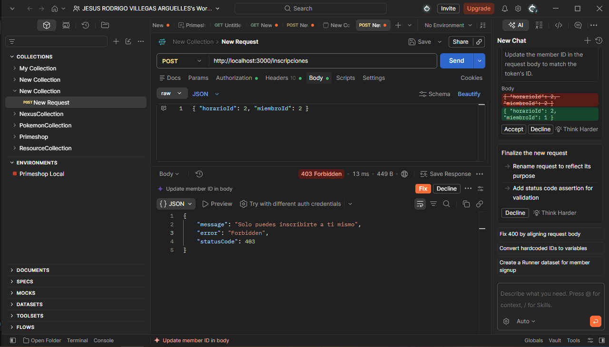

**Documentación en /docs con el candado**

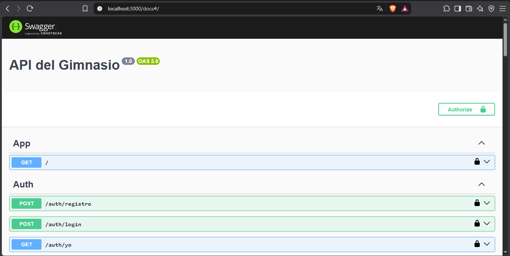

**Migración de usuarios**

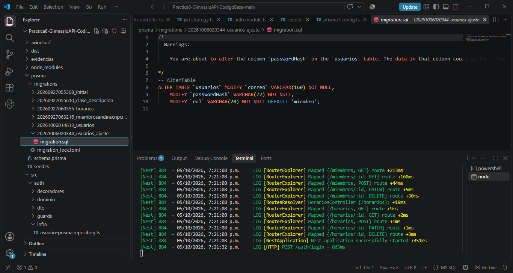

**Inicio de sesión después de reiniciar el servidor**

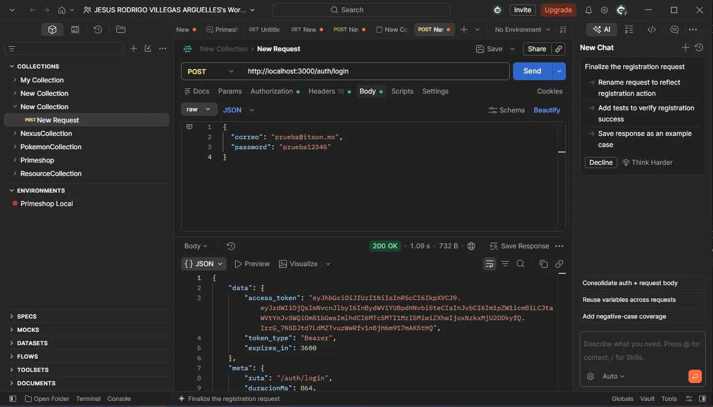

### Tarea: roles

**Sin token (401)**

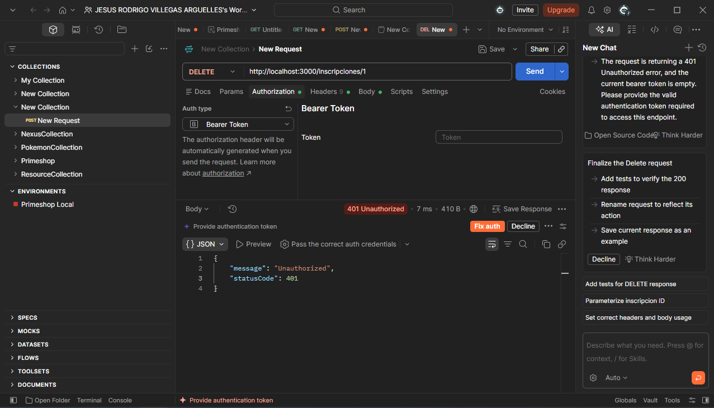

**Miembro (403)**

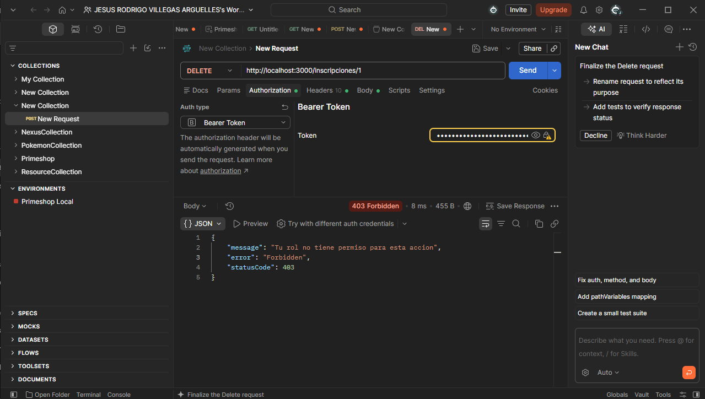

**Entrenador (200)**

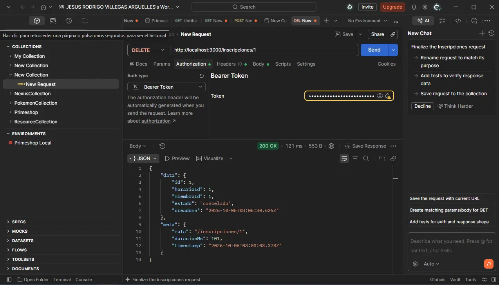

## Diagrama de la base de datos (Práctica 8)

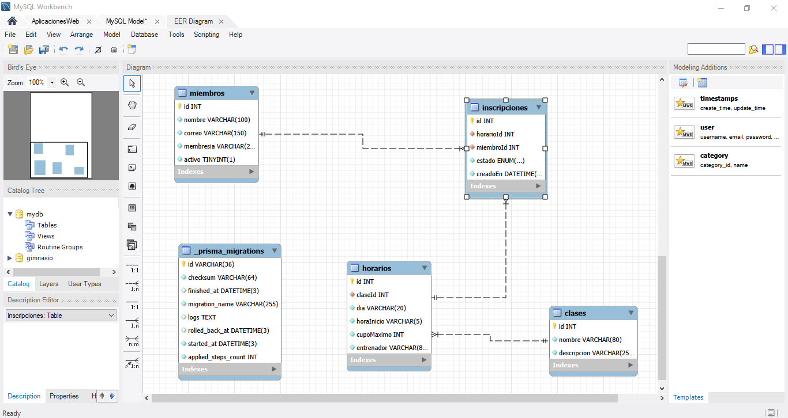

## Cómo correrlo

```bash
npm install
npm run start:dev
```

El servidor levanta en `http://localhost:3000`. En `peticiones.http` está la batería completa de
pruebas (requiere la extensión "REST Client" de VS Code).

## Estructura

```
src/
  clases/        CRUD de clases del gimnasio
  horarios/      CRUD de horarios (día, hora, cupo, entrenador)
  miembros/      CRUD de miembros del gimnasio
  inscripciones/ inscribir a un miembro a un horario, con reglas de cupo y duplicados
  datos/         datos de arranque (seed) que usan Horarios y Miembros
```

Cada módulo sigue la misma forma: `dominio/` (entidades + interfaz del repositorio), `dto/`,
`infra/` (repositorio en memoria) y el token de inyección en `<módulo>.tokens.ts`.
